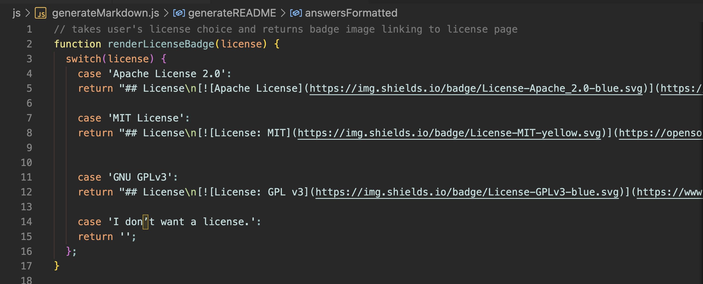
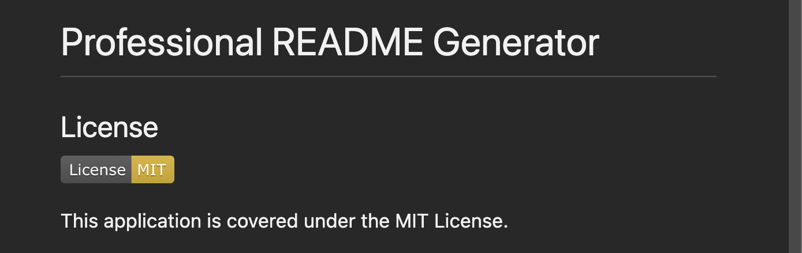

# Challenge Seven: Node.js - Professional README Generator

## Project Description

Challenge Seven required us to develop a command line application that generated a professional README for the user so that they may devote more time coding their project. In this challenge, we utilized node and the inquirer package to feed the user prompts. Their answers would then be returned in markdown format and written to a README file in their respective sections.  

### Demo

[Google Drive Demo Link](https://drive.google.com/file/d/1G2AT_L6HObaEfjWh5C_i3xsd_qqBjMxo/view)

1. The following video shows a demo of the README Generator

2. The directory is shown before the README has been generated. 

3. The user runs the application by entering 'node index.js' into their terminal.

4. The user is asked various prompts relating to their project. 

5. A README.md file is generated.

6. The new README file includes their information assigned to their respective sections.

7. The preview of the README is displayed. Along with their information, there is a table of contents linking to each section, a license badge (if the user selected a license), and a link to their GitHub profile. 

NOTE: This demo generated README.md can be found in the following path:  ./assets/js/README.md

### License

The following image shows the switch statement that matches the user's license choice:

The following image shows the license badge result in markdown:

### Link to Github Repository
[https://github.com/jffsun/chall-seven-readme-generator](https://github.com/jffsun/chall-seven-readme-generator)